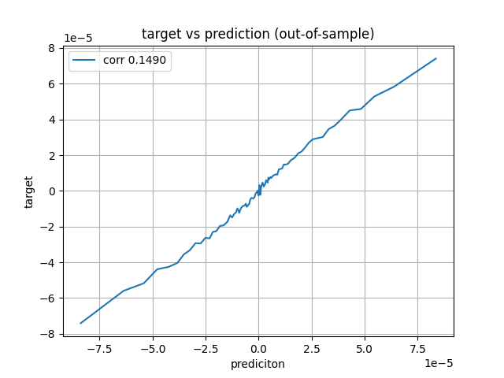
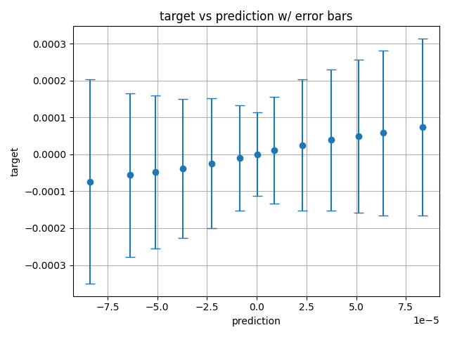
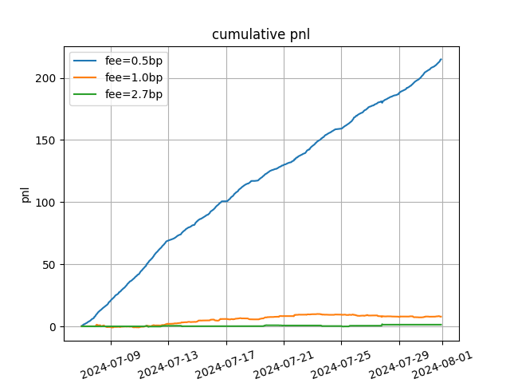
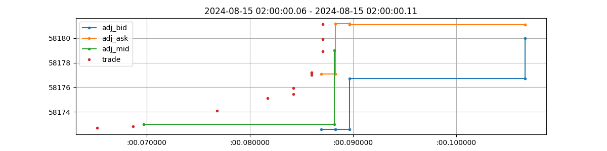
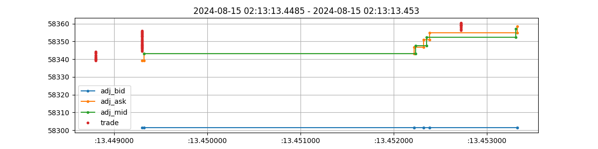

# Regression and Backtesting on BTCUSDT

<table>
    <tr><td>
    DISCLAIMER: This document is a strictly confidential communication to and solely for the use of the recipient and may not be reproduced or circulated. If you are not the intended recipient, you may not disclose or use the information in this documentation in any way. The information is not intended as an offer or solicitaion with respect to the purchase or sale of any security.
    </td></tr>
</table>

The library source code for the analysis is available at https://github.com/donele/crlib.

## Data

Analysis is done with the trade, bbo, and midpx data from 2024-07-01 to 2024-07-31. BTCUSDT at Binance-USDM is chosen for this analysis because it is one of the most liquid products in the data set.

| |Trade|BBO|
|---|--:|--:|
|Updates per second|6.5|0.43|
|Median time to update|108 ms|636 ms|
|Data latency approx.|5 - 20 ms|20 - 200 ms|
|Volume per second|$187k| |

### Trade Data

In July, 2024, there are 6.5 trades per second or 561K per day. Median time between trades is 108 microseconds. Notional traded volume is 187K per second or 16.2 Tr. dollars per day. The volume more or less agrees with the publicly available information for the trading venue, therefore, it would be safe to assume that the client is receiving the complete trade data, or at least near complete data without a significant data loss.

The exchange provides the exchange timestamp which can be used to reliably estimate the latency in the data delivery. The latency of the trade data has been estimated to be around 5 ms - 20 ms from a few examples. More accurate study of the latency may be done in the future.

Question:

 - Is the trade price available (ts) as soon as the data is received (t0), therefore t0 is equal to ts for trades?
 - Each trade update has min_price and max_price, which may mean that the trade data are aggregated by the exchange. Are there market participants who receive unaggregated trade updates? What are the criteria for the aggregation?

### BBO Data

The rate of non-synthetic bbo updates is 0.43 per second or 37k per day. Comparing the rate to the number of trade updates, it is obvious that the exchange is delivering only a small fraction of the bbo data to the subscribers. The median time between bbo updates is 636 milliseconds.

The bbo data is delayed compared to the trades, especially when there is larger volume. From a couple of examples, the latency of the bbo data has been estimated between 20 ms and 200 ms. More extreme latencies may well exist in the data.

Questions:

 - What kind of model is used to calculate the adjusted prices? Does the model get updated regularly?
 - In bbo, ts - t0 is the time taken to run the model to calculate adj_askpx and adj_bidpx?
 - What would it take to improve the latency?

## Data Sampling

The bbo and trade data are downsampled to 100 millisecond intervals. The length of the interval is arbitrarily chosen. Shorter sampling intervals may be tried in the future analyses. Depending on the length of the prediction horizon to be used, a longer sampling interval may be used, or a subset of the sample may be used.

Features are built from the prices, trade quantity, bidqty, and askqty. The adjusted mid_px, which is calculated upon receiving a trade update and then using a model, is used to calculate the past returns and future returns.

Dozens of features are considered during the fitting process. Only a few of them are selected algorithmically through cross validation.

## Fitting

5 days' data is used for fitting. 1 day's data immediately following the fitting window is used for the hyper parameter tuning and feature selection. The model calculates the prediction for the following day's data points.

After that, the procedure is repeated by shifting all the dates by 1 day to the future. This subsequent fitting may automatically choose different feature sets or different look-back windows. This flexibility may help the model deal with the regime changes.

Alternatively, the feature set may not be allowed to change throughout the rolling fitting. That will reduce the compuation for the fitting substantially. One could also argue that there will be less risk of overfitting due to having less number of free parameters. More research would be needed to decide which method is superior. However, it was observed in some simulated scenarios that having the flexible feature set is crucial in the success of the strategy.

The fitting is repeated until the predictions are calculated for the entire desired period.

The prediction horizon is set to 6 seconds. It is possible to let the model choose the prediction horizon adaptively depending on the market condition, and it may be a topic for future analysis. The prediction has a correlation of 0.1490 with the future 6 second return.

Following plot shows the relationship between the target and prediction in 100 prediction quantiles. Top and bottom 1 percent of the predictions' sizes are approximately 0.8 basis point. The predictions do not exceed the trading fee which may be 2 - 5 basis points, depending on the trading venue.

The standard deviation of the targets are added in the following plots to show the noisy nature of the target-prediction relationships.

## Backtesting

Trading is simulated with following rules.

 - If the time since last trade is larger than 5 seconds, liquidate and do not take a position.
 - If prediction exceeds the trading cost, take a position of USD 1.00.
 - If it is expected that the loss from holding the current position would be larger than the trading cost, liquidate.

The cost of crossing the spread is calculated as half of the adjusted width (0.5 * adj_width). Different exit strategies may be tested in the future analyses.

The trading is simulated between 2024-07-07 and 2024-07-31. A number of simulations are generated with different trading fees. The fill ratio is assumed to be 100%.

The trading cost for the market is 2.7 basis points. The model performs reliably only when the fee is 0.5 basis point or less for the 25 day backtesting period. Given the simplicity of the model and the abundant possibilities to improve the model, this is not a discouraging result. Here is the summary of each simulation with different trading fees.

|fee| n_take|n_exit|n_flip|n_pos|g_pos|holding|bias|mbias|d_volume|d_pnl|d_shrp |
|---| --:|--:|--:|--:|--:|--:|--:|--:|--:|--:|--: |
| 0.5 | 6054.1|214.2|5839.8|-0.0168|0.9272|12.9|0.12|0.09|12108.1|8.6|8.23 |
| 1.0 | 165.4|51.6|113.8|0.0034|0.5349|272.4|0.12|0.14|330.8|0.3|0.44 |
| 2.7 | 0.8|0.6|0.2|0.0488|0.0679|6801.0|0.12|-0.57|1.7|0.1|0.16 |

 - fee: Trading fee in basis points.
 - n_take: Number of position-takes per day.
 - n_exit: Number of position-exits per day.
 - n_flip: Number of position-flips per day.
 - n_pos: Average net position.
 - g_pos: Average gross position.
 - holding: Average holding period in seconds.
 - bias: A measure of overfitting, independent of the trading fee.
 - mbias: A measure of overfitting, calculated from only marketable data points.
 - d_volume: Average daily trading volume.
 - d_pnl: Average daily pnl.
 - d_shrp[1]: Daily sharpe ratio. (Daily-ized from the 100 ms sample intervals.)

[1]: "d_shrp" (Daily Sharpe Ratio): In high frequency trading, the annual sharpe ratio does not explain the strategy very well. Rather, a daily sharpe can provide more insight. For example, a daily sharpe of 0.44 means that a daily pnl can be negative with a 33% chance, assuming a normal distribution.

Following table shows that theres are more losing trade than winning ones (w_rat = 0.45 for fee = 0.5). The overall pnl comes out positive because the pnl for the wins are bigger than the losses (w_mean = 84.09 > abs(l_mean) = 42.87). The profitability between the buys and sells are similar to each other (b_gpt = 14.5, s_gpt = 14.0).

|fee| w_rat|bw_rat|sw_rat|gpt|b_gpt|s_gpt|w_mean|w_std|l_mean|l_std |
|---| --:|--:|--:|--:|--:|--:|--:|--:|--:|--: |
| 0.5 | 0.45|0.45|0.45|14.24|14.51|13.97|84.09|101.04|-42.87|53.11 |
| 1.0 | 0.51|0.50|0.51|19.32|31.27|7.81|269.97|550.79|-238.72|491.81 |
| 2.7 | 0.57|0.6|0.5|648.20|961.74|-135.65|2503.1|2719.29|-1824.97|1567.6 |

Questions:

 - Can one trade after a trade is received, but before the adjusted mid price is calculated, using the trade price as a proxy?
 - Would BTCUSDT be more efficient and harder to trade for profit? If so, the strategy would perform better in other products.
 - How much slippage is expected? Can it be assumed to be a constant, or can it be modeled as a dynamic value?
 - What are usual fill ratios for market-taking orders? For the market making orders?
 - How much can one trade without causing too much market impact?
 - How often can one trade without causing too much market impact?
 - Should the backtesting be run with both market making and market taking orders? If so, how reliable is the market making backtesting?
 - How much is this linear model correlated to other existing models?
 - Would on-chain transaction or mempool information be useful for predicting the future price on the centralized exchange? One possibility is that the central exchange is more liquid, and a trader with information would use the centralized exchange to realize their alpha. In that case, the on-chain information would not predict the central exchange's price. On the other hand, if there are big transactions on-chain, the centralized exchange may react to that. The effect in either case may manifest in different ways depending on time horizons.

## Latency Effect

The model is more likely to trade on the samples taken less than 100 ms after a trade, rather than ones taken more than 100 ms after the most recent trade. The average pnl is higher for the samples taken less than 200 ms after a trade, compared to the others. This indicates that reducing the latency by tens of milliseconds is likely worth the effort.

The same may be true for the timescale of a millisecond or even less. However, the data set available for this analysis may not meet the requirements for such a study due to the latency in the trade data of about 5 ms, time taken to calculate the adjusted mid prices, and the missing updates in the bbo data.

Questions:

 - Is there any room to improve the latency of the market data feed system?
 - Is the model that calculates the adjusted mid prices using the memory cache efficiently? Can the code be optimized further, e.g. for cache warming or branch misses?
 - Are there market participants who receive the data of better quality and less latency, such as designated market makers?

An example is shown in the next plot. The adjusted mid price becomes available about 1 ms after the last trade.

The delay from trade to adjusted price in another example shown below is 3 ms.

## Future Plans

Using adj_midpx instead of other price information has a great impact on the performance. This needs to be double-checked.

Try some other feature building ideas.

Try using L1 or L2 regularization in the fitting on the training data, and then use the model without the extra step of feature selection on validation data. This will keep the feature set more stable, less adaptable to the changes in the market conditions, and may lower the risk of the overfitting.

Try shorter or longer validation and prediction periods. Different values may be more optimal.

Make the prediction horizon a variable which can be decided through cross validations.

Try nonlinear models. They may outperform the linear models, or they may be used together with the linear models.

Test the model during extremely volatile periods. If the model doesn't perform well in those periods, come up with a solution that takes the regime changes into account. Separate models for volatile periods may be used for such periods. Detecting different regimes is a hard task and it would require substantial research, and it should be done without a look ahead bias.

Run a longer backtesting and see if there is any extended period of poor performance. If such a period is found, try to identify the characteristics of those periods and come up with a solution.

Linear models can produce excessive prediction if the feature takes a value outside the range found in the training data. See if this is an issue in a backtesting for a longer period. If necessary, implement a way to control the range of the prediction.

Estimate the scalability of the strategy.

The same modeling idea can be easily applied to many other products.

Fitting data may be sampled following certain events to build a more specifically targeted model.

Shorter or longer time horizons can be analysed. Those can lead to separate trading strategies, or the predictions for different horizons may be combined into a single strategy.

Analyze the pnl as a function of latency. Analyze the pnl as a function of the time elapsed since last trade.
